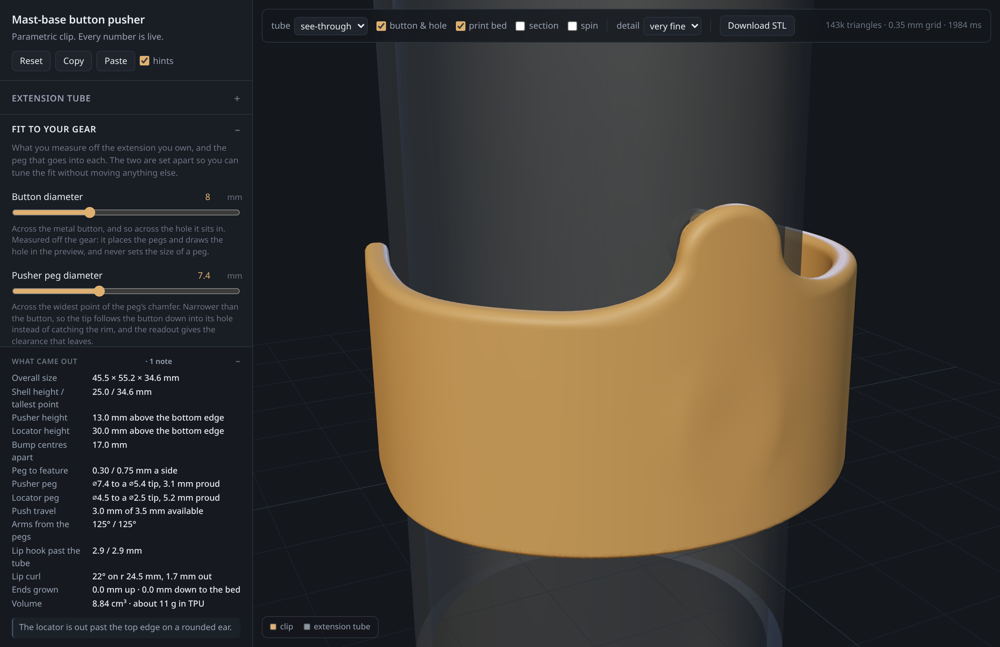
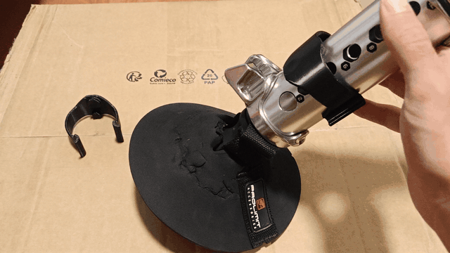
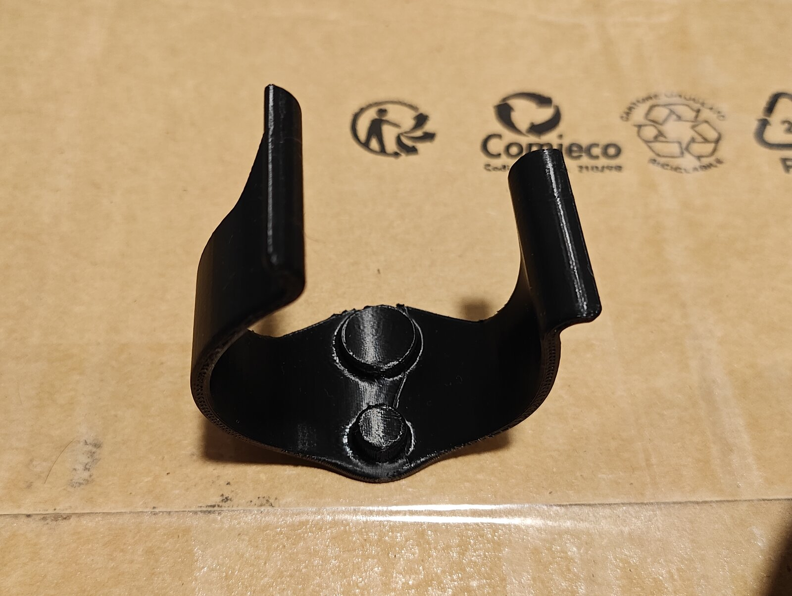
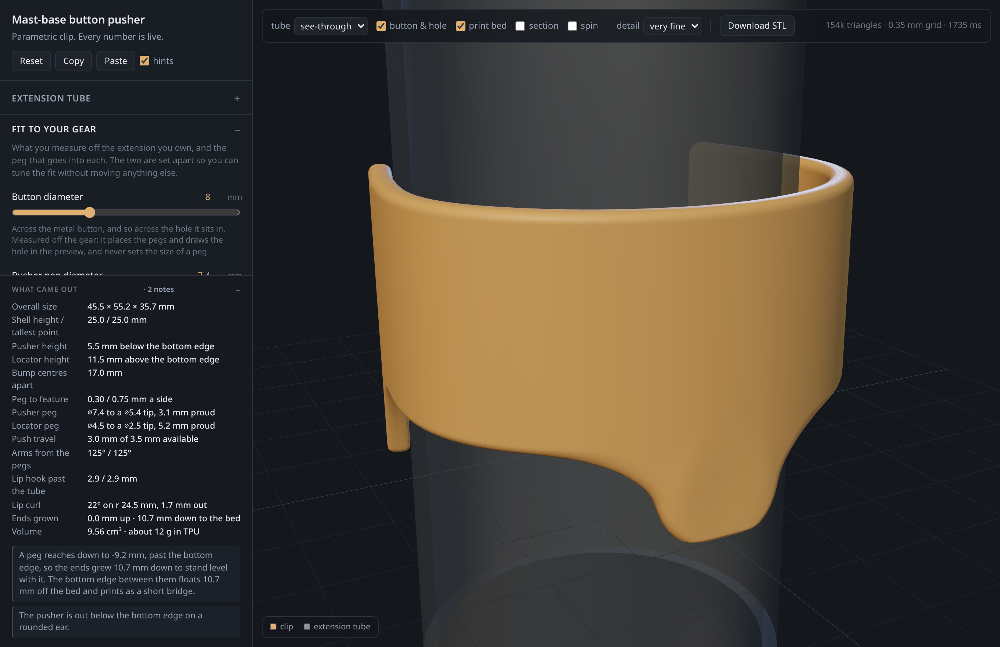

<div align="center">

# button-pusher

A parametric clip for a windsurf mast extension: you push it with a thumb and it presses the mast base's release button for you.

The whole part is one signed-distance field. Swellings, ears, fillets and feet that organise themselves when the numbers change. Live browser preview. No build step, no dependencies. Watertight STL straight out of the page.



Try it in a browser: **https://button-pusher.tintan.do/**

</div>

<br/>

## The problem

A windsurf mast base locks into the extension with a spring-loaded steel button, and getting the two apart means holding that button down while you pull. It is small, it is stiff, and by the time you want it out your hands are cold, wet and full of sand. A clip that wraps the tube and turns that into a thumb push is an afternoon of CAD, right up to the moment you ask it to fit somebody else's extension.

That is the whole difficulty. The thing being designed is not a shape, it is a family of shapes, and it has to come out sound at numbers nobody has tried yet.

- **The numbers belong to the gear, not to the designer.** Tube diameter, button diameter, the diameter of the locator hole beside it, and the bare stretch of metal between those two: four measurements taken off an extension with a caliper, and no two brands agree on them. A model that only stands up at the numbers it was drawn at fits exactly one extension, which is the same as being drawn by hand in the first place.
- **The features are placed by different people for different reasons, and they collide.** The pegs go where the gear puts them. Shell height is set by hand feel, and nothing should move it: someone picks 25 mm because that is what looks right on the rig. Nothing coordinates the two, so the pusher regularly lands near the shell's edge, and sometimes past it with nothing under it at all. Drawn as a solid model that is where things break: the fillet at the base of a boss has no face left to run onto, an edge reference disappears, and the feature tree throws a rebuild error at a number you never tested. The usual fix is to constrain the inputs so the collision cannot happen, which takes away exactly the freedom the part exists to give.
- **Almost nothing on it is a face.** It is blends, the whole way round: a wall that swells to carry a peg, an ear on a spreading root where a peg has left the shell entirely, a fillet at every peg base, an end that grows taller on one side and tapers back to nothing as it runs round to the back, a lip whose curvature has to ease in rather than step, or the crease catches the light. In a boundary representation every one of those is an operation with its own failure mode, and they all fail the same way: *radius too large for this edge*, at some combination of numbers you did not think to try.

So the part is not drawn. It is a function. `sdf(x, y, z)` returns the distance to the nearest surface, negative inside, and every feature is a term in it: the shell is the arm curve offset in both directions, a bump is a capsule about a radial axis, a swelling is the bump's own footprint swept back onto the shell, the print bed is a half-space. They are combined with a smooth minimum, which is one operation that has no radius-too-large in it, and which produces a fillet at every join for free. Change a number and all of it recomputes, because none of it was ever placed.

What that buys is that the part cannot fail to be a solid. A field always has a zero level set, so there is always something to mesh; what you can get wrong is the shape, not the topology, and a wrong shape is visible in the preview. What it costs is that nothing can be looked up. A feature tree knows the wall is 2.8 mm because somebody typed 2.8. A field knows nothing: the only way to find out what the wall came out as is to walk the surface and measure it, which is what `tools/check.mjs` does across 38 parameter sets on every push.

The brief this was built to, in plain words and with no geometry in it, is [`docs/spec.md`](docs/spec.md).

## Features

- **Every dimension is live**: 42 parameters in seven groups, each with its range and its own note, and the whole control panel is generated from one list
- **Fit to your own gear**: tube diameter, button and locator-hole diameters, and the bare metal between them, measured the way you can actually measure them
- **Pegs sized apart from the features they enter**: chase a fit by taking a peg down a tenth without anything else in the part moving
- **Self-organising supports**: a peg near the shell's edge bulges it, a peg past the edge gets a rounded ear on a spreading root, and a peg below the shell drops the print bed and stands the part on three feet
- **A wall that stays the wall**: measured square to the outer face rather than radially, so it holds its thickness where the shell leans off parallel and round the whole turn of the lip
- **A lip walked as a chain of arcs**: curl and radius, both measured against the tube, with the turn easing in so there is no curvature step to catch the light
- **A preview tube with the gear drilled into it**: the button and the locator hole as real bores through a real wall, so what you are judging is the fit and not a picture of it
- **A readout, not just a render**: overall size, peg clearances, push travel against the air gap, how far each lip hooks past the tube, how far the ends had to grow, volume and mass in TPU
- **Warnings with reasons**: the preview says when the shell will bottom out before the button is down, when a peg will catch the rim of its hole, when neither lip hooks far enough to hold, and what to change
- **A two-minute test piece**: a short slice of the same shell carrying both bumps, for checking gap, spacing and whether the locator finds its hole
- **STL export at 0.3 mm**, meshed in a worker so the page stays live, named after the settings that produced it
- **Offline by construction**: three.js is vendored, there is no build step, and nothing is fetched at runtime

## Quick start

The preview is hosted at **https://button-pusher.tintan.do/**, which needs nothing at all. To run it locally, or to run the checks, you need Node 18 or newer and nothing to install: there are no dependencies.

```bash
git clone https://github.com/tintando/button-pusher.git
cd button-pusher
npm start                # http://localhost:8173/
```

`server.mjs` is Node's own `http` module serving the directory, and the page opens on the default clip already meshed. Drag any slider and it rebuilds: 150 to 550 ms at the default 0.7 mm grid on an Intel Core i5-13400F, about two seconds at the finest. **Download STL** re-meshes at 0.3 mm and saves the file.

The offline tools need no server:

```bash
npm run check            # mesh 38 parameter sets and check every one of them
npm run render           # sphere-traced views straight off the field -> out/
```

## Using it

1. **Measure your extension.** Tube diameter, across the button, across the locator hole beside it, and the bare metal between the two features, straight up the tube. Four numbers with a caliper.
2. **Put them in the *Fit to your gear* group.** The pegs are placed from the feature measurements; the peg diameters are separate numbers, so changing one never moves anything else.
3. **Read the readout.** *Push travel* has to be less than the air gap or the shell bottoms out on the tube before the button is down. *Lip hook past the tube* is what holds the clip on: under a millimetre the preview flags it, and under 0.3 mm it warns that friction rather than geometry is doing the holding.
4. **Print the test piece.** Turn on *Test piece* for a short slice of the same shell carrying both bumps. Two minutes on the bed, and it tells you nearly everything: the gap, the spacing, and whether the locator finds its hole.
5. **Print the real one**, standing upright, no supports. Then push it.



The toolbar over the viewport is all preview, and none of it reaches the part:

| Control | What it does |
|---|---|
| **tube** | Solid, see-through or hidden. See-through is what lets you watch a peg sit in its hole |
| **button & hole** | Drills the two gear features through the tube's wall, or leaves a plain tube |
| **print bed** | The grid the part actually stands on, which is not always `z = 0` |
| **section** | Cuts both the clip and the tube on the plane through the pegs |
| **spin** | Turns the model slowly, for looking at a blend from every side |
| **detail** | Meshing grid, from 1.0 mm down to 0.35 mm. Export is always 0.3 mm whatever this says |

Settings persist in `localStorage`, and **Copy** and **Paste** move them as JSON. **Reset** goes back to the starting point in the brief.

<details>
<summary>Settings saved by an older version</summary>

They still load, and the conversions are all one-way and automatic:

- The old `buttonZ` becomes the equivalent shell offset, and the old `tipClear` becomes a pusher peg diameter.
- A locator hole is invented at 1.5 mm over the peg, because there never was a number for it. Check that one against your own gear.
- Lips used to be drawn on `flare × t²` and are now walked as a chain of arcs, so an old pair of lip numbers converts to the same turn at the same tightness: the same height at the tip, reached by a rounder route, on a wall that stays its full thickness all the way out.
- Any saved curl now starts a little further back along the arm, because the turn eases in rather than starting at full tightness. The lip still stands off the tube by the same amount.
- A saved clip with the flare turned right off comes out different in one place: with no curl to hold it back, the tube contact slides to the very tip of the arm rather than sitting a flare span short of it.
- A saved clip with the mouth swung off the peg axis reads a different pair of hooks from the ones it showed before. The hook is now measured through the mouth, which is where the clip actually comes apart, rather than along the peg axis. The part itself is unchanged.

</details>

## Print notes

Standing upright, no supports. The layers then run around the shell, which is the direction the part flexes in. With both pegs on the shell the whole bottom edge is the first layer; with one hanging below it, the first layer is three feet and there is a bridge where the bottom edge crosses the gap between them.

Not PLA. It wants something tough and springy that shrugs off sun, salt and a hot car: TPU 95A, TPU-based filaments, PETG or PCTG all work, and the softer the material the thicker you want the wall.

Wall thickness is the dial for push feel. Print 2.4, 2.8 and 3.2 mm and pick by hand. Settle the height and the bump positions first, because both make the clip stiffer, and so do the grown ends.

The `47 mm extension` case in `tools/check.mjs` is not a made-up set of numbers: it is a real extension, measured, on a short shell that hangs the pusher off its bottom edge and stands the part on grown feet. That is the case the printed clip came from, and it is in the check list so that it keeps working.



One place the print is not fully 45 degree clean: the underside of each peg over the few millimetres it stands proud of the tube. A peg that has to enter a hole cannot be wider than that hole, so it cannot carry a chamfer there. It is short, curved and on the underside, and it prints with a little droop that does no harm. *Peg neck* and *Underside slope* are the knobs if you want to trade it against tip size.

## How it works

**The part is drawn at rest.** That is the datum everything else is measured from: sitting on the tube with nobody touching it, the ends gripping, the back standing off by the air gap, the pusher tip on the button flush with the outside of the tube, and the locator down in its hole. Nothing is preloaded and the button is not held down. *Pusher reach* is then the travel, how far the tip has to go past the outside of the tube to send the button home, and it has to be smaller than the air gap or the shell bottoms out before the button is down. Where the grip ends up mid-push is the shell's business and is not drawn.

**The curve.** The inner surface is `tube radius + gap(angle)`. The gap is the full air gap across the back, closes smoothly to nothing just inside each lip, and the lip then flares back out. So the two contact patches are simply where the curve comes closest: there are no pads, feet or steps anywhere on the inside face. Three numbers control it, air gap, hug transition and flare curl, and none of them is a control point.

**The lip is walked, not drawn.** Where the grip ends, the lip carries on as a chain of tangent arcs turning away from the tube by the *flare curl* you ask for, at the tightness the *flare radius* asks for. Both are measured against the tube: a quarter turn has the lip pointing straight out from it, a half turn has it rolled over into a hook facing back the way it came, and a curl of 0 leaves the end following the tube to its tip. Anchoring the lip's start on the furthest round the arm gets rather than on its tip is what lets the curl go past a quarter turn without the wrap changing meaning: the shell still reaches exactly as far round the tube as the wrap says, and anything past 90 degrees comes back inside that.

**The turn eases in.** The chain does not start at full tightness. Its curvature ramps up from the shell's own over the first stretch of the lip, long enough that it comes in at no more than a tenth of a mm⁻¹ per mm travelled, and then holds. Meeting the shell tangentially is not enough on its own: a step in the curvature is a crease you can see under a light, however smooth the join is on paper. Easing in costs the lip half the run-in in extra length, which is why the flare starts a little further back on the arm than the bare radius would put it.

**The wall is measured square to the face, never radially.** Straight out from the axis is only the same thing while the shell is parallel to the tube. Where the grip is closing, the wall leans off radial, and a radial measure keeps its height while losing its thickness; a lip turning 66 degrees away loses far more, 3 mm square to the surface becoming 1.8, and would taper to a blade exactly where it has to spring. So the shell's wall is divided by how steeply it leans, and along the lip both faces are true offsets of the one walked curve. `tools/check.mjs` walks the outer face of every case and prints what it found: 2.79 to 2.80 mm on a 2.8 mm setting over the whole arm, and 3.00 to 3.00 on a 3 mm setting from the join to the tip at any curl.

The walk goes round the real cross-section rather than the unrolled one, and that is the whole reason for it. Unrolled, a millimetre of arc is a millimetre at the tube's surface but more than that further out, so a wall stacked up in unrolled coordinates comes out as much as a fifth thicker than it was set, which reads, correctly, as a fat lip on a thin shell.

**The end is cut where the walk runs out**, square across both faces, rather than by a plane laid across the arm. Past about 150 degrees of curl a plane would have come back round far enough to shave the root of the lip it belongs to, pinching the wall exactly where a hook is levering on it. The one thing the curl will not do, which the preview says out loud, is bend tighter than the wall can go round: the outer face turns on a radius one wall thinner, so the flare radius is held up to whatever leaves it 0.4 mm of radius to turn on. The other hold-back is the arm, since a curl is not allowed more than nine tenths of the arm it sits on.

**Retention comes off the hook**, which is how far each lip reaches past the widest point of the tube, and so how far the arm has to spread to let the tube out. That is half the wrap and nothing else, and it falls away fast, because a generous flare curls the lip back off the tube just as the arc is reaching round:

| half the wrap | 105° | 110° | 115° | 120° | 125° | 140° | 150° |
|---|---|---|---|---|---|---|---|
| hook | -0.2 | 0.0 | 0.7 | 1.7 | 2.9 | 7.5 | 11.1 mm |

Under about 115 degrees a lip stops hooking at all, and it is friction rather than geometry holding the clip on: press the button and it can lever off. The 250 degree default hooks 2.9 mm at each lip. The readout gives both arms and both hooks, and the preview says so when they stop holding. The hook is measured by pulling the clip off through its own mouth, which is where it actually comes apart, rather than along the peg axis, because the mouth does not have to sit opposite the pegs.

**Swinging the opening.** *Opening offset* swings the mouth round the tube: the wrap total and the pegs stay where they are, one arm grows and the other shrinks. The gap curve stays anchored on the pegs rather than on the middle of the arc, so both bumps keep the full air gap behind them however far it is swung, each arm simply closing from full gap to contact over its own share of the wrap. It costs no grip at all, because the clip leaves the way it came in, straight out through the middle of the mouth, and swinging the mouth turns the section without changing it. What it does cost is room: an arm is not allowed below 40 degrees, and the preview says so when it holds the offset back rather than quietly taking less than you asked for.

**The bumps.** Each is a straight peg of its own diameter that flares out into the wall only once it is clear of the tube, since anything wider inside that line would foul the hole the peg has to enter. A push drives the whole clip inwards, so that line allows for the travel as well as the neck on both pegs, and with a typical air gap barely bigger than the reach there is then no room left to flare at all: each peg meets the wall on its fillet. The widest point of a peg is therefore its own diameter, everywhere it could ever reach a rim. Below the flare line the underside runs away at 45 degrees so it prints with nothing under it. The tip is chamfered so it finds its hole and slides deeper as you push rather than binding, and the pusher's flat tip carries a shallow dish that cups the button.

A peg's **diameter is measured across the widest point of its chamfer**, which is the size that has to clear the hole. The chamfer is then what decides the flat tip left beyond it, `tip = diameter - 2 × chamfer`: set the chamfer to zero and the peg ends square, wind it up and the peg becomes a cone.

**Features and pegs are separate numbers.** *Button diameter* and *locator hole diameter* are what you measure off the extension. *Pusher peg diameter* and *locator peg diameter* are what gets printed. Nothing derives one from the other, so you can chase a fit, taking a peg down a tenth because it went in tight, without the rest of the part moving under you. *Bump spacing* is the bare metal between the two features, edge of the button to edge of the locator hole, straight up the tube, which is what you can put a ruler on. Centre to centre then comes out of that plus the two feature radii, so it is a measurement of your gear alone and resizing a peg leaves the pegs exactly where they were. If the hole on your extension is not directly above or below the button, *Locator round the tube* slides it sideways in millimetres along the surface, sideways only, so the gap above stays what you set.

**The swellings.** Every peg carries a patch of shell shaped like its own footprint plus a margin, swept back to the nearest point that is still on the shell. Inside the outline it changes nothing. Near the edge it bulges the edge out. Past the edge it becomes a rounded ear on a spreading root, still joined, still self-supporting. Shell height never moves to accommodate a bump.

**The lopsided ends.** A peg that has drifted past an edge leaves nothing bearing on the tube at its own height, so the clip stands on a lopsided tripod and rocks when you push. The ends grow past it to put that material back: only as much as they need, only on that side, tapering back to normal as they run round toward the back. Move the peg back inside and they relax to symmetric on their own.

**Below the bottom edge.** `z = 0` is the bottom edge of the shell, but the print bed is wherever the part actually stops. That is `z = 0` right up until a peg hangs below the shell, which is what *shell offset* does if you slide it far enough: the pusher ends up on an ear of its own, the same swelling that carries the locator when it runs off the top. The bed then drops to clear the lowest peg by the *grown-end overshoot*, the ends come down with it, and the part prints on three feet, the ear at the back and an end at each side. The stretch of bottom edge in between floats off the bed and prints as a short bridge, which is the price of putting a peg down there. The descent to the bed is given no more run than it has drop, so it stays near 45 degrees or steeper instead of lying back into a shallow overhang, and everything that does reach the bed is trimmed flat and chamfered.



**Meshing.** Naive surface nets: one vertex per grid cell that straddles the surface, quads around every sign-changing grid edge. Short, watertight, and smooth enough for a field that is already smooth. Normals come from the field's own gradient rather than from the triangles, so the surface stays smooth at any grid size. It runs in a worker, so dragging a slider never blocks the page, and the export path is the same mesher at 0.3 mm: a real export of the 47 mm clip comes out at about 238,000 triangles.

**The preview tube is drawn, not modelled.** *Tube diameter* is the one control in that group the clip is built around; wall, opening and opacity only change the picture, and they repaint without re-running the mesher. Wind *Tube shown* down from 360 degrees and the wedge comes out of the front, the side the clip opens onto, following the opening round when that is swung off the peg axis, so you can look straight in through the clip's own mouth. The button and the locator hole are drilled through the wall at the size you measured them, straight through rather than following the curve of the wall, so the bore is the same width where the peg goes in and where it comes out. That is the whole point of drawing them: a hole that narrowed toward the axis would flatter the fit, and the fit is what you are looking at.

## Checks

There is no unit-test suite, because there is very little in here that a unit test has a grip on. What the code produces is geometry, so the checks mesh it and measure it.

```bash
npm run check            # 38 parameter sets meshed and measured
npm run tubecheck        # the preview tube: closed, bores straight and true to size
npm run render           # ray-traced views straight off the field    -> out/
node tools/slice.mjs     # cross-sections with the tube drawn in, plus
                         # a table of the gap to the tube by angle    -> out/
node tools/browsercheck.mjs   # drive the real page in headless Chrome
```

`check`, `render` and `slice` take `key=value` overrides, for example `node tools/slice.mjs tubeDia=42 wall=2.4`.

`npm run check` is the gate CI runs. Each of its 38 cases is meshed and then asked: is it a single part, is it watertight, is the winding outward, does the wall hold its setting along the whole arm, do both peg tips stop where the numbers say, is there material on the print bed and none below it, and did the cases that should warn actually warn. The list is deliberately nasty: walls from 1.6 to 4.5 mm, wraps from 170 to 320 degrees, pegs above the shell, below it, both below at once, lips curled 180 degrees onto themselves, a curl tighter than the wall can make, a peg wider than its hole, and one real extension measured off actual gear. It exits non-zero on any problem, and takes a little over 20 seconds.

`npm run tubecheck` is the same idea for the preview tube, which is stitched by hand rather than meshed from a field: closed, bores that are straight cylinders of the diameter they claim, normals of unit length.

`node tools/browsercheck.mjs` drives the real page in headless Chrome, waits for the first mesh, pokes a dozen parameters the way a user would, checks that the tube controls do not re-mesh anything, reads the readout back, and fails on any console error. It needs Chrome, a running server and Node 22, which is why it is not in CI.

`check.mjs` may report a handful of *pinched edges*: places where the mesher put two sheets of surface through one grid cell. The mesh stays closed and slicers handle it, and a finer grid usually makes them disappear.

## Scope and known gaps

- **CI covers the model, not the page.** `npm run check` and `npm run tubecheck` are a correctness gate rather than a compile one: they mesh the part and measure what came out, and they fail the build on any of it. `npm run render` runs behind them as a smoke test of the field and the PNG encoder. What none of them touch is `src/app.js` and `src/worker.js`, which only ever run in a browser, so CI does no more than parse those. `tools/browsercheck.mjs` is what exercises the page, and it is run by hand.
- **Naive surface nets round off what they cannot see.** Any feature smaller than the grid, and every sharp edge, comes out softened at the grid scale. That suits this part, which is meant to be round everywhere, and it would not suit a part with a critical edge on it.
- **The field is evaluated in JavaScript on the CPU.** A 0.35 mm grid is about two seconds and a 0.3 mm export a little more. That is fine for a slider and would not be fine for a part ten times the size.
- **The preview leans on recent browser features**: WebGL2, import maps and ES module workers. A browser more than a couple of years old will not run it, and nothing on the page says so when it fails.
- **Nothing in here checks that the part fits your gear.** It checks that the geometry is sound and that the pegs went where the numbers said. Whether those numbers describe your extension is what the two-minute test piece is for.
- **No fatigue data.** The brief asks for a few hundred pushes without cracking around the bump supports, the ears and the grown ends. The part has been printed from these numbers and put on the gear; nothing has been cycled and counted.

## Repository map

```
button-pusher/
├── index.html              # the whole page: panel, viewport, toolbar
├── 404.html                # what the host serves for an unknown path
├── server.mjs              # static server, node:http and nothing else
├── src/
│   ├── clip.js             # the model: the whole part as one distance field
│   ├── params.js           # every knob, its range and its help text, and the UI is generated from it
│   ├── mesh.js             # surface nets, field normals, binary STL
│   ├── tube.js             # the preview tube: a section of tube with the gear holes drilled through
│   ├── worker.js           # meshing off the main thread
│   ├── app.js              # viewer, controls, export
│   └── style.css
├── tools/
│   ├── check.mjs           # 38 parameter sets, meshed and measured
│   ├── tubecheck.mjs       # the preview tube, meshed and measured
│   ├── render.mjs          # offline sphere tracer, straight off the field
│   ├── slice.mjs           # cross-sections and a gap-by-angle table
│   ├── browsercheck.mjs    # drives the real page in headless Chrome
│   └── png.mjs             # PNG encoder, so the renderers need no library
├── vendor/                 # three.js r170 and OrbitControls, checked in on purpose
├── .github/workflows/
│   ├── ci.yaml             # the checks below
│   └── pages.yaml          # the same gate, then the page, src/ and vendor/ to Cloudflare Pages
└── docs/
    ├── spec.md             # the brief, in plain words
    └── media/              # the images in this README, and their shot list
```

`vendor/` is 1.3 MB of three.js in the repository, and that is deliberate rather than lazy. It is what makes `git clone && npm start` the whole of the setup: no install step, no lock file, no network, and a preview that still runs on a laptop at the beach with no signal. An import map in `index.html` points the bare specifier `three` at `vendor/three.module.js`, so the source imports it by name exactly as it would from `node_modules`. Pinning one revision is also the only thing a project with no build step can do: there is no bundler to resolve a version range, so there is no range to resolve.

`out/` is the opposite case and is not in the repository. It is 4.7 MB of renders, cross-sections and screenshots written by the tools, all of it regenerable in seconds by `npm run render`, so it is in `.gitignore` along with exported `.stl` files.

## Built with

Plain ES modules in a browser, and Node's standard library everywhere else. three.js r170 for the viewport, vendored. No framework, no bundler, no transpiler, no test runner, no CAD kernel, and an empty dependency list: `package.json` has four scripts in it and nothing to install. The offline renderer writes its own PNGs, the browser driver talks to Chrome over the DevTools protocol using Node's built-in `fetch` and `WebSocket`, and the server is thirty-five lines of `node:http`.

## License

MIT, see [LICENSE](LICENSE).

`vendor/three.module.js` and `vendor/OrbitControls.js` are three.js r170, copyright 2010-2024 Three.js Authors, and are redistributed here under their own MIT licence rather than covered by the copyright line above.
